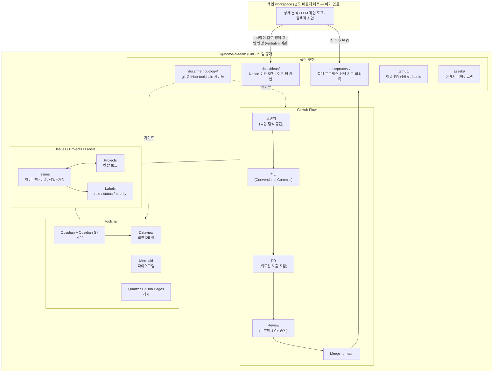

# 아키텍처 — 이 레포는 무엇이고 왜 이렇게 생겼나

`README.md`가 "어디서부터 볼까"를 안내한다면, 이 문서는 "전체 그림이 왜 이 모양인지"를 설명한다. 팀원이거나 미래의 자신이 이 레포를 처음 마주쳤을 때, 구조의 이유까지 이해하도록 쓴다.

---

## 1. 2-레포 구조 — 왜 나눴나

이 프로젝트는 레포가 두 개다.

| 레포 | 성격 | 이 레포에 있나 |
|---|---|---|
| **개인 workspace** | 개인 상세 분석, LLM 작업 로그, 아직 정리 안 된 탐색 기록 | ❌ 별도 비공개 레포 — 여기 없음 |
| **`lg-home-ai-team`** (이 레포) | 팀 전달판 — 팀원 전원이 보는 정본 | ✅ 지금 보고 있는 레포 |

**왜 분리했나.** 개인 workspace는 아이디어를 다듬는 과정에서 나오는 초안, 반쯤 틀린 가설, LLM과 주고받은 탐색적 대화, 아직 팀에 공유할 준비가 안 된 메모를 담는다. 이런 내용을 팀 레포에 그대로 흘려보내면:

- 팀원이 "이게 확정된 방향인지 아니면 그냥 혼잣말인지" 구분할 수 없다.
- `CONTRIBUTING.md` § "순서와 노출"이 지키려는 규범(완성본을 던지지 않되, **의도적으로 노출한 것만** 노출한다)이 무너진다 — 개인 탐색 기록은 애초에 "노출하기로 결정"된 적이 없는 자료다.
- 심사 대상 레포(`lg-home-ai-team`)가 팀의 실제 판단·산출물이 아니라 개인 브레인스토밍 잡음으로 오염된다.

그래서 개인 workspace → (사람이 검토·정제) → `docs/ideas/`, `docs/process/` 등 팀 레포 반영, 순서를 강제한다. 팀 레포에 들어오는 모든 문서는 "이건 팀에 보여줄 준비가 됐다"는 판단을 한 번 거친 것이다.

---

## 2. 폴더 구조

```
lg-home-ai-team/
├── README.md                          진입점 — 어디서부터 볼지 안내
├── ARCHITECTURE.md                    이 문서 — 전체 구조와 이유
├── SETUP.md                           GitHub 쪽 남은 설정 체크리스트
├── CONTRIBUTING.md                    협업 규칙 요약 (첫 커밋 전 필독)
│
├── docs/
│   ├── process/                       아이디어 설계 프로세스 · 선택 기준 · 회의록
│   │                                   (Notion 원본 이관, verbatim 보존)
│   ├── ideas/                         후보·조사 아이디어 문서
│   │                                   (Notion 이관 5건 + 이후 팀 제안)
│   └── methodology/
│       ├── git-github-협업.md         git/GitHub 협업 가이드 (초보 팀원용)
│       └── toolchain.md               저장층 셋업 가이드 (Notion → GitHub 이주)
│
├── .github/
│   ├── ISSUE_TEMPLATE/
│   │   ├── idea.md                    아이디어 제안 이슈 템플릿
│   │   └── task.md                    작업(Task) 이슈 템플릿
│   ├── PULL_REQUEST_TEMPLATE.md       PR 템플릿
│   └── labels.md                      라벨 목록 (역할 / 상태 / 우선순위)
│
└── assets/                            이미지·다이어그램 원본 파일
```

### 폴더별 역할

- **`docs/process/`** — "어떻게 아이디어를 짜는가"에 대한 방법론과 그 과정의 기록. 9단계 설계 프레임워크, 아이디어 선택 기준(1차 knockout → 2차 평점 → 3차 가중), 회의록. 팀의 의사결정 근거가 여기 쌓인다.
- **`docs/ideas/`** — 후보·조사 아이디어 문서. 최초 5건은 Notion 원본을 그대로 옮긴 것이며 재작성하지 않는다. 이후 팀원이 PR로 제안한 문서도 여기에 쌓인다 (§ 4 참고).
- **`docs/methodology/`** — 팀이 "어떻게 협업 도구를 쓰는가"에 대한 가이드. 아이디어 콘텐츠가 아니라 협업 인프라 문서.
- **`.github/`** — GitHub 네이티브 협업 장치(이슈 템플릿, PR 템플릿, 라벨 정의)의 설정 소스.
- **`assets/`** — 이미지 등 바이너리 자산. Notion의 presigned S3 URL이 만료되는 문제(`docs/ideas/냉장고-erp-서비스.md`에서 실제로 겪음)를 피하려고 레포 안에 직접 저장한다.

---

## 3. 협업 매체 — GitHub Flow + Issues + Projects + Labels

### 흐름: branch → commit → PR → review → merge

`CONTRIBUTING.md`와 `docs/methodology/git-github-협업.md`에 절차가 상세히 있다. 여기서는 **왜 이 구조를 쓰는지**만 짚는다.

git/GitHub의 각 매체는 단순한 "저장 수단"이 아니라, **"누가·무엇을·언제 보는가"(노출 타이밍)를 구조화하는 장치**다:

- **브랜치 = 독립 탐색 공간.** `main`에서 갈라져 나온 브랜치 위에서는 남의 눈치를 보지 않고 자유롭게 시도한다. 아직 누구에게도 보여줄 준비가 안 된 상태라도 상관없다.
- **커밋 = 의미 단위 스냅샷.** Conventional Commits 형식(`<type>: <description>`)으로, 하나의 커밋이 "하나의 완결된 변경"이 되게 한다. 나중에 특정 변경만 되돌리기 쉽게 하는 장치이기도 하다.
- **PR = 의도적으로 노출하기로 결정한 지점.** 다 만들고 나서 여는 게 기본이 아니다 — 문제 정의나 뼈대만 있는 상태에서 Draft PR로 먼저 열어 "이 방향 맞아?"를 묻는 것도 정상이다. 핵심은 "PR을 여는 순간 = 팀에게 보여주기로 결정한 순간"이라는 점.
- **Review = 형식적 통과 의례가 아니라 실제 판단 지점.** 리뷰어 1명 이상의 승인 없이 머지 금지, `main` 직접 push 금지 — 이 두 규칙이 "완성본을 조용히 흘려보내는" 경로를 막는다.
- **Merge = 팀 정본에 반영.** 이 시점 이후에야 다른 팀원의 작업 기반이 된다.

이 구조가 지키려는 건 `CONTRIBUTING.md`의 "순서와 노출" 규범이다: 완성된 결과물을 통째로 던지면 다른 팀원이 스스로 문제를 탐색하고 소유감을 가질 기회가 사라진다. 그래서 뼈대 → 공유 → 각자 견해 형성 → 완성, 순서를 강제하고, 그 강제 지점이 바로 브랜치/PR 경계다.

### Issues — 아이디어와 작업의 단위

- **아이디어 = 이슈 하나** (`아이디어 제안` 템플릿). 투표는 👍 리액션, 상태는 라벨로 관리.
- **작업 = 이슈 하나** (`작업(Task)` 템플릿). 완료 조건(Definition of Done)을 체크리스트로 명시.

### Projects — 칸반

이슈를 상태별 컬럼(제안 → 토론중 → 채택/기각, 또는 작업 진행 단계)으로 옮기며 진행 상황을 한눈에 본다. Notion 데이터베이스 칸반 뷰의 대체물.

### Labels — 세 그룹

`.github/labels.md` 정본. `role:`(ai/backend/frontend/docs), `status:`(제안/토론중/채택/기각), `priority:`(high/med/low) 세 그룹으로 나뉜다.

---

## 4. toolchain 요약

상세는 `docs/methodology/toolchain.md` 참고. 핵심만:

- **저작**: GitHub 웹 또는 원하는 markdown 편집기. Obsidian + Obsidian Git은 로컬 저작이 필요한 팀원의 선택 도구다.
- **로컬 DB 뷰**: Dataview 플러그인 — frontmatter(`status`, `votes` 등) 기반 표/칸반 쿼리. Notion 데이터베이스 뷰의 로컬 대체.
- **다이어그램**: Mermaid — GitHub·Obsidian 둘 다 네이티브 렌더, 설치 불필요.
- **게시**: MkDocs Material + GitHub Pages. `docs/`의 모든 markdown을 자동으로 navigation과 검색에 포함한다.

---

## 5. Source of truth 원칙

- **markdown이 정본이다.** `docs/` 아래 markdown 파일이 팀의 최종 판단·기록이다.
- **`docs/ideas/`의 아이디어 원문은 verbatim 보존한다.** Notion에서 이관한 원본을 재작성하지 않는다. 아이디어 내용을 갱신하고 싶으면 원문을 고치는 게 아니라, 새로운 절이나 후속 문서(회의록, 이슈 코멘트 등)로 갱신 이력을 남긴다. 이래야 "언제 어떤 판단으로 아이디어가 바뀌었는지"가 git 히스토리에 그대로 남는다.
- 개인 workspace의 분석·LLM 작업 로그는 이 레포에 들어오지 않는다 (§ 1). 팀 레포에 반영되는 순간부터가 "팀 정본"이다.

---

## 6. 결정 대기 — 팀 판정 필요 (아직 확정 아님)

다음 두 항목은 **이 문서가 확정하지 않는다.** 실제 spec 문서를 재료로 팀이 판정할 열린 항목이다.

### ① Conventional Commits — 타입 집합 · scope · 강제 도구

- 현재 `docs/methodology/git-github-협업.md`, `CONTRIBUTING.md`가 참고용으로 쓰는 타입: `feat`, `fix`, `docs`, `refactor`, `test`, `chore`. scope는 권장이지만 강제하지 않음. commitlint 같은 강제 도구는 아직 도입하지 않음.
- **미확정 사항**: 이 타입 집합을 그대로 쓸지, 프로젝트 특성(AI 모델링/백엔드/프론트엔드/데이터가 섞인 스마트홈 프로젝트)에 맞춰 추가·조정할지, scope 표기를 권장에서 강제로 바꿀지, commitlint/husky 같은 자동 검증 도구를 붙일지 — 모두 팀 판정 대기.

### ② 브랜치 전략 — GitHub Flow vs trunk-based

- 현재 `CONTRIBUTING.md`, `docs/methodology/git-github-협업.md`가 채택해 쓰는 것은 GitHub 공식 GitHub Flow(단일 `main` + 단명 기능 브랜치 + PR).
- **미확정 사항**: 팀 규모·프로젝트 진행 속도가 커지면 trunk-based development(feature flag, 더 짧은 브랜치 수명) 같은 대안으로 옮길지, 지금의 GitHub Flow를 학기 끝까지 그대로 유지할지 — 팀이 실제 진행 상황을 보고 판정할 항목.

---

## 7. 전체 그림 (Mermaid)


