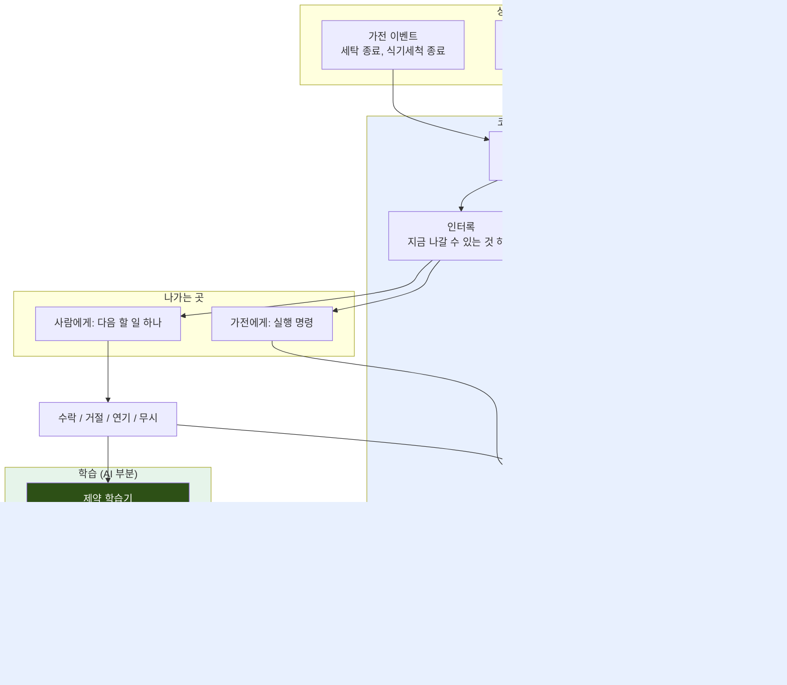
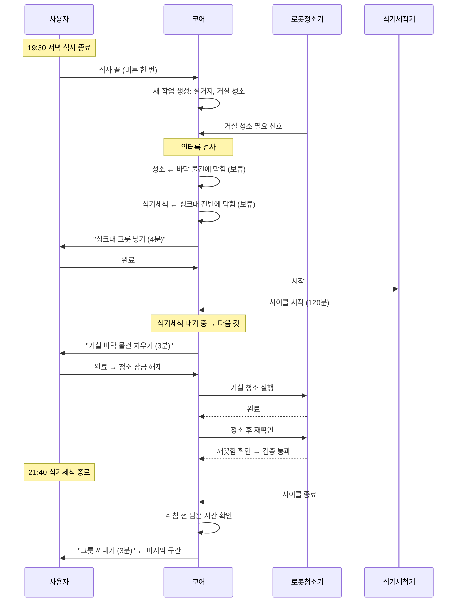

# 집의 병목은 가전 안에 없다

!!! note "이 문서의 상태"

    아이디어 하나를 끝까지 밀어본 기록입니다. 완성안이 아니라 **논의 시작점**으로
    썼습니다.

    **앞부분 — 기본기.** 1~11절은 문제 정의와 코어 로직입니다. 공개 데이터로 한 번
    검증했고 꽤 좁혀졌습니다.

    **뒷부분 — 확장점.** 12~13절은 그 코어 위에 무엇이 자라날 수 있는가입니다.
    사업·사회적 의미와 서비스 설계 축을 놓았는데, **여기는 갈래만 있고 정해진 것이
    적습니다.**

    앞이 촘촘한 것은 확신이 커서가 아니라 그쪽부터 팠기 때문입니다. 코어 로직은
    Python 네 덩어리로 작고, 그것을 감싸는 서비스는 훨씬 다양해질 수 있습니다.
    그 부분은 혼자 정할 것이 아니라고 생각해서 축과 갈래만 놓았습니다.

    **14절 질문 1이 이 문서에서 가장 큰 질문입니다.**

## 1. 시작한 질문

얼마 전 자동화 경제에 관한 연구를 봤습니다. 소프트웨어 개발이 **전부** 자동화된다고
가정해도 조직 전체 생산성은 소폭밖에 오르지 않는다는 내용이었습니다. 이유는 간단합니다.
자동화되지 않은 나머지 일들이 전체 속도를 잡고 있기 때문입니다.

이 논리를 집에 적용해봤습니다.

세탁기, 건조기, 식기세척기, 로봇청소기는 각자 자기 일을 이미 자동화했습니다. 그런데
집은 여전히 어질러집니다. 그렇다면 **병목은 가전 안이 아니라 가전 바깥에 있습니다.**

개별 가전을 더 똑똑하게 만드는 제안은 이 병목을 건드리지 못합니다. 그래서 이 제안은
가전을 하나도 개선하지 않습니다.

## 2. 병목의 정확한 위치

`빨래하기`는 하나의 일이 아닙니다. 쪼개보면 이렇습니다.

```
[모으기][넣고 시작]──세탁 50분──[건조기로 옮김]──건조 90분──[꺼내기][개기][넣기]
  사람     사람        기계          사람           기계         사람  사람  사람
```

**기존 자동화는 가운데 두 칸만 덮습니다.** 앞쪽은 예약 기능이 어느 정도 덮습니다.
뒤쪽 네 칸은 아무도 안 건드립니다.

그리고 집이 망가지는 형태가 정확히 이 구간에 멈춘 물건들입니다. 소파 위 빨래더미,
건조대에 사흘 걸린 옷, 식기건조대에 쌓인 그릇, 식탁 위 안 치운 것들.

> 어질러진 집은 더러운 집이 아닙니다. **가야 할 곳이 정해져 있는데 도중에 멈춘 물건들**입니다.

게다가 멈춤의 대가는 지연이 아니라 재작업입니다. 세탁 끝난 빨래를 밤새 두면 다시
돌려야 합니다.

## 3. 왜 알림으로는 안 되는가

"빨래 완료"가 무슨 뜻인지 물어보면 답이 갈립니다.

| | 완료의 의미 |
|---|---|
| 세탁기 | 사이클이 끝났다 |
| 완료 알림 | 사이클이 끝났다고 알렸다 |
| **사람** | **옷이 옷장에 들어갔다** |

세탁기가 끝났다고 알린 뒤부터 옷장에 들어가기까지, 그 상태를 아는 시스템이 없습니다.
**사람 머릿속에만 있습니다.**

이게 집안일이 피곤한 진짜 이유라고 생각합니다. 할 일을 못 외워서가 아니라, 여러 개의
끝나지 않은 일이 각각 어느 단계에 있는지를 사람이 혼자 기억하고 있어야 하기 때문입니다.

그리고 가전이 늘어날수록 이 부담은 커집니다. 알림은 부담을 없애는 게 아니라 형태를
바꿉니다. 기억하는 부담이 방해받는 부담으로 바뀔 뿐입니다.

## 4. 일들은 서로 독립이 아닙니다

지금까지는 빨래 하나만 봤습니다. 그런데 실제 저녁에는 빨래와 설거지와 청소가 동시에
걸쳐 있고, 이것들은 **서로 독립이 아닙니다.**

- 바닥에 물건이 있으면 로봇청소기가 못 돕니다.
- 싱크대가 잔반으로 차 있으면 식기세척기에 넣을 수가 없습니다.
- 건조대에 지난 빨래가 널려 있으면 새 빨래를 널 데가 없습니다.
- 그리고 사람은 한 번에 하나만 합니다.

순서를 잘못 잡으면 하나가 다른 하나를 막고, 막힌 채로 저녁이 끝납니다. 체크리스트는
이걸 표현하지 못합니다. 항목이 나란히 있을 뿐 **서로 막는 관계가 없기 때문**입니다.
그래서 "빨래하기 O"가 절반만 끝난 상태에서도 체크됩니다.

### 이 문제를 이미 푼 분야가 있습니다

컴퓨터 CPU는 여러 작업을 겹쳐서 처리합니다. 파이프라인이라고 부릅니다. 그런데 이 분야에서
정작 어려운 문제는 "어떻게 겹치나"가 아니라 **"언제 겹치면 안 되나"**입니다. 겹치면 안 되는
상황을 해저드라 하고, 세 종류로 정리되어 있습니다. 집의 상황이 여기에 그대로 들어맞습니다.

| 해저드 종류 | CPU에서 | 집에서 |
|---|---|---|
| 자원 충돌 | 같은 장치를 동시에 쓸 수 없음 | 싱크대가 차서 그릇을 못 넣음 |
| 순서 의존 | 앞 결과가 나와야 뒤가 실행됨 | 바닥을 치워야 로봇이 돔 |
| 예측 실패 | 분기 예측이 틀려 계획이 무효 | 외식하게 되어 저녁 계획이 무효 |

CPU가 이걸 처리하는 방식이 중요합니다. 작업 순서를 미리 짜두는 게 아니라, **지금 무엇이
무엇을 막고 있는지를 표로 들고 있다가 나갈 수 있는 것만 내보냅니다.** 막힌 것은 세워둡니다.
계획이 틀어져도 무너지지 않는 이유가 이것입니다.

집에 옮기면 이렇게 됩니다.

```
시스템이 들고 있는 표:  싱크대 = 사용중 / 건조대 = 비어있음
                        사람 = 작업중 / 세탁기 = 45분째 진행중
        |
        v
지금 나갈 수 있는 일 하나만 내보냄  ->  사람 또는 가전
        |
        v
끝났는지 확인  ->  표 갱신
```

**사람이 표를 기억할 필요가 없어집니다.** 3절에서 말한 "머릿속에만 있는 상태"를 시스템으로
옮기는 방법이 이것입니다.

## 5. 그런데 그 표를 누가 채우나 — 여기가 AI입니다

CPU는 무엇이 무엇을 막는지 **설계자가 미리 다 알고 있습니다.** 회로를 만든 사람이
정했으니까요.

집은 다릅니다. 무엇이 무엇을 막는지 **아무도 안 알려줍니다.** 사용자에게 물어봐도 못
씁니다. 자기도 의식하지 못하니까요. 어떤 집은 소파 위 빨래더미가 아무것도 막지 않고,
어떤 집은 그것 때문에 저녁 내내 거실을 못 씁니다.

그러면 방법은 둘 중 하나입니다.

1. **일반 규칙을 하드코딩한다** — 모든 집에 공통인 규칙이 충분히 많다면 가능합니다.
2. **집마다 배운다** — 공통 규칙이 별로 없다면 이 방법뿐입니다.

어느 쪽인지는 논쟁할 게 아니라 **재보면 됩니다.** 그래서 실제로 재봤습니다.

## 6. 재본 결과 — 공통 규칙은 0개였습니다

워싱턴주립대가 공개한 CASAS 데이터셋을 썼습니다. 실제 가정 189곳에 센서를 달고 2007년부터
2024년까지 모은 생활 기록이고, 활동 라벨이 붙어 있습니다. 이 중 38가구를 분석했습니다.

가구별로 "A가 B보다 반드시 먼저 온다"는 순서 규칙을 뽑아내고, 그 규칙 목록을 가구끼리
비교했습니다.

| | |
|---|---|
| 발견된 순서 규칙 종류 | 151개 |
| **모든 가구에 공통인 규칙** | **0개** |
| 한 가구에만 있는 규칙 | 90개 (59.6%) |
| 가구별 규칙 개수 | 0개 ~ 40개 |

임계값을 어떻게 바꿔도 (가구 수 20~38, 활동 수 10~15, 기준 3종 — 총 18개 설정)
**공통 규칙은 항상 0개**였고, 고유 비율은 40~72%였습니다.

한 집은 규칙이 0개인데 다른 집은 36개입니다. 같은 알고리즘, 같은 기준에서요.
**규칙이 몇 개인지조차 그 집의 특성입니다.**

5절의 두 갈래에 답이 나왔습니다. **하드코딩할 공통 규칙이 존재하지 않습니다.** 집마다
배우는 수밖에 없고, 그래서 이 프로젝트에 AI가 필요합니다.

반대로 말하면, 공통 규칙이 대부분이었다면 저는 이 아이디어를 접었을 것입니다. 규칙
엔진으로 충분했을 테니까요.

분석 코드는 이 문서와 함께 올려두었습니다. 데이터도 공개 데이터라 누구나 재현할 수 있습니다.

## 7. 어떻게 배우는가

사용자에게 "당신 집 규칙을 알려주세요"라고 물으면 못 씁니다. 자기도 모르니까요.

대신 시스템이 이렇게 합니다.

```
"지금 로봇 돌릴까요?"  →  아니오
   거실에 있는 것: [빨래더미, 장난감, 의자, 충전기]

   빨래더미와 장난감만 있어도 안 되나요?  →  아니오
   빨래더미만 있어도 안 되나요?          →  예

   → 배웠음: 바닥에 장난감이 있으면 로봇 금지    (질문 2번)
```

제약 학습(constraint acquisition)이라는 연구 분야의 방법입니다. 전체를 묻지 않고 일부만
물으면 답하기 쉽고, 거절 하나에서 절반씩 좁혀가면 적은 질문으로 규칙을 찾아냅니다.

**중요한 건 사용자가 아무것도 설정하지 않는다는 겁니다.** 시스템이 내는 제안 하나하나가
곧 질문이고, 사용자가 그냥 살면서 거절하거나 미루면 그게 학습 데이터가 됩니다.

알림은 일을 사용자에게 되던집니다. 이 방식은 사용자의 반응을 흡수해서 다음부터 덜
묻습니다. 방향이 반대입니다.

## 8. 우리가 하지 않는 것

이 제안은 다음을 **의도적으로** 하지 않습니다.

- 집 전체 상태를 카메라로 자동 감지하기
- 여러 가전을 실제로 연동하기
- 물리적인 집안일을 로봇이 대신하기
- 조명·온도·음악 자동 조절

이유는 §1의 논증 그대로입니다. **그 층들은 이미 해결됐거나 LG가 이미 하고 있습니다.**
병목이 아닙니다. 우리가 그걸 또 하면 자사 제품과 겹칩니다.

우리는 **연결만** 합니다.

## 9. 만들 것과 보여줄 것

| | 만드나 |
|---|---|
| 상태 저장소 + 일들 사이 의존성 그래프 | O — 본체 |
| 막힌 일을 세우고 가능한 일 하나만 내보내기 | O — 본체 |
| 거절·연기에서 그 집 규칙 학습 | O — AI 부분 |
| 하고 나서 실제로 됐는지 확인, 안 됐으면 다시 짜기 | O |
| 실제 기기 연동 | 가능하면 1대 — 없어도 시뮬레이터로 성립 |
| 집 상태 자동 감지 | X — 우리 문제가 아님 |

### 시연 (30초)

```
거실 청소가 필요한 상태
   ↓
시스템: 거실 바닥에 치울 물건이 있음 → 로봇 보류
   ↓
사용자에게: "거실 바닥 물건 치우기 (3분)"   ← 한 번에 하나만
   ↓
완료 → 로봇 실행 → 청소 후 재확인 → 완료
```

체크리스트 방식과 나란히 돌리면 차이가 보입니다. 한쪽은 7개 항목을 한꺼번에 던지고,
한쪽은 지금 할 수 있는 하나만 냅니다. 그리고 하나가 미완료되면 다시 짭니다.

### 참고 — 작년 LOCUS를 보면 이 문제가 보입니다

우리 구조에 LOCUS가 필요한 것은 아닙니다. 다만 "일이 다른 일에 막힌다"는 것이 추상적인
얘기가 아님을 보여주는 사례라 적어둡니다.

LOCUS는 오염을 예측해 청소할 구역을 고릅니다. 그런데 바닥에 물건이 있으면 예측이 아무리
정확해도 청소가 안 됩니다. 실제 코드에도 그 조건을 보는 부분이 없고, 청소 후 상태를 다시
재는 부분도 없습니다.

작년 팀이 못해서가 아니라 **그 프로젝트의 문제 범위가 아니었기 때문**입니다. 예측 정확도를
올리는 것과 실행 전제를 확인하는 것은 다른 문제입니다. 우리가 다루려는 것이 후자입니다.

## 10. 실제로 어떻게 돌아가는가

여기까지가 개념이고, 이 절은 그것이 실제로 도는 물건이 될 수 있는지를 봅니다.
공상과학과 구현 가능한 것의 경계를 분명히 하려는 목적입니다.

### 전체 구조



핵심은 **AI가 실행 경로에 없다**는 것입니다. AI는 의존성 그래프를 갱신할 뿐이고, 실제
발행 결정은 결정론적인 인터록이 합니다. AI가 죽어도 시스템은 마지막에 배운 규칙으로
계속 돕니다. 이게 "AI가 실패했을 때 기본 동작이 있는가"에 대한 답이기도 합니다.

### 저녁 한 번을 따라가면

설거지와 거실 청소가 엮이는 실제 시나리오입니다.



체크리스트였다면 19:30에 7개 항목이 한꺼번에 떴을 것입니다. 여기서는 **한 번에 하나씩,
그리고 순서가 막히지 않는 순서로** 나갑니다. 마지막에 "그릇 꺼내기"까지 챙기는 것이
2절에서 말한 종결 구간입니다.

### 기술 스택

새로 만드는 것과 기성품을 쓰는 것을 나눕니다.

| 계층 | 무엇으로 | 우리가 만드나 |
|---|---|---|
| **상태 저장소** | SQLite | **O — 본체** |
| **의존성 그래프** | Python 자료구조 | **O — 본체** |
| **인터록·발행** | Python | **O — 본체** |
| **제약 학습기** | Python (제약 마이닝) | **O — AI 부분** |
| 앱 화면 | React 등 | 최소 화면만 |
| 기기 통신 | MQTT | 표준 프로토콜, 만들 것 없음 |
| 기기 시뮬레이터 | Python 타이머 | 데모용 |

**핵심은 이 네 덩어리가 전부 Python 로직이라는 것입니다.** 학습 모델도 무거운 신경망이
아니라 로그에서 규칙을 세는 방식이라(6절에서 쓴 것과 같은 방식) 노트북에서 수십 초에
돕니다. 특별한 하드웨어도, GPU도, 새 센서도 필요 없습니다.

기기와 주고받는 것은 이 정도입니다.

```
받는 것:  사이클 시작 / 사이클 종료 / 남은 시간
보내는 것: 시작 명령
```

MQTT는 스마트홈 표준 프로토콜이고 대부분의 기기가 이 형태를 씁니다. 실제 기기를 못
붙이는 부분은 타이머로 대체합니다 — 세탁기가 진짜 50분을 돌든 시뮬레이터가 50초를
돌든 **인터록 로직은 똑같습니다.**

### 무엇을 mock으로 두는가

정직하게 나눕니다.

| | 실제로 | mock/수동 |
|---|---|---|
| **의존성 판정과 발행** | O — 본체 | |
| **제약 학습** | O — 본체 | |
| **사용자 반응 수집** | O (실제 입력) | |
| 로봇청소기 실행 | O (기기 1대 정도) | |
| 세탁/식기세척 사이클 | | O (타이머) |
| "빨래가 건조기에 있다" | | O (버튼 한 번) |
| 싱크대 상태 | | O (버튼 한 번) |
| 바닥에 물건이 있다 | | O (버튼 한 번) |

**사람이 버튼을 누르는 것은 회피가 아니라 설계입니다.** 8절에서 말했듯 우리가 푸는 것은
감지가 아니라 의존성입니다. 감지는 이미 풀린 문제이고 LG가 실제로 팔고 있습니다.

그래서 상태가 어디서 오는지는 우리 문제가 아닙니다. 버튼이든 도어 센서든 무게 센서든
로봇청소기 카메라든, **"싱크대가 차 있다"는 사실이 들어오기만 하면 그 뒤 로직은
똑같습니다.** 실제 제품에서는 이 자리에 센서가 들어가고, 우리는 그 자리를 비워둔 채
만듭니다.

### 한 학기에 되는가

작년 팀이 실제로 만든 양이 기준입니다. `locus-AI` 레포는 약 6주에 37개 커밋이었고,
4개 레포를 합쳐 소스 300여 개 파일이었습니다. 그중 상당 부분이 시뮬레이션과 mock입니다.

우리가 만드는 것은 Python 로직 네 덩어리와 최소 화면입니다. 학습 모델을 새로 훈련시킬
필요가 없고(로그에서 규칙을 세는 방식), 센서를 새로 만들 필요도 없습니다.

가장 큰 위험은 코드 양이 아니라 **제약 학습기가 쓸 만한 규칙을 뽑아내느냐**인데, 그
부분은 6절에서 공개 데이터로 이미 한 번 돌려봤습니다.

## 11. 아직 못 푼 것

숨기지 않는 편이 낫다고 생각해서 적습니다.

- 사용자가 거절했을 때, 그게 "규칙 위반이라 안 됨"인지 "그냥 피곤함"인지 가르는 방법이
  아직 없습니다. 지금 후보는 강행했을 때 실제로 실패하거나 다시 해야 하는 경우만
  규칙으로 인정하는 것입니다.
- 처음 며칠은 아무 규칙도 모릅니다.
- CASAS 데이터로는 순서 규칙까지만 확인됩니다. 자원 충돌(싱크대가 차서 못 넣는 것)은
  이 데이터에 안 잡혀서, 그 부분은 시뮬레이션 데이터로 가야 합니다.

## 12. 사업 관점에서

이 아이디어를 창업 수업 쪽에서도 쓸 생각이라 그 관점도 적어둡니다.

### 왜 지금인가

한국 1인 가구는 이미 전체 가구의 3분의 1을 넘었고 맞벌이 비중도 계속 오릅니다. 동시에
가전 자동화는 각 기기 안에서는 충분히 성숙했습니다. **집안일을 대신해줄 사람은 줄었는데,
조율해야 할 기기는 늘어난 상태**입니다. 이 두 곡선이 만나는 지점이 이 제안이 서 있는
자리입니다.

### 누가 돈을 내는가

두 가지 경로가 있고 성격이 다릅니다.

| | 사용자에게 판다 | 제조사에 붙는다 |
|---|---|---|
| 형태 | 구독 앱 | 가전 생태계의 기본 기능 |
| 수익 | 월 구독료 | 직접 수익 없음 |
| 진짜 가치 | — | **기기를 더 살 이유** |
| 위험 | 가사 앱은 이탈률이 높음 | 제조사 종속 |
| 이 제안에 맞는 쪽 | 약함 | **강함** |
| 근거 | 체크리스트 앱들이 이미 실패 | 기기가 늘수록 가치가 커짐 |

핵심은 이겁니다. **이 서비스는 기기가 많을수록 좋아집니다.** 기기 하나만 있으면 조율할
게 없습니다. 세 대, 다섯 대가 되면 그때부터 가치가 생깁니다.

즉 이건 가전을 파는 회사 입장에서 **기기를 하나 더 살 이유**입니다. 지금 스마트홈이
"기기를 사면 앱이 딸려온다"라면, 이건 "앱이 좋아서 기기를 하나 더 산다"에 가깝습니다.
LG 같은 회사에 직접 붙는 이유가 여기 있습니다.

### 왜 경쟁사가 쉽게 못 따라오는가

기술이 어려워서가 아닙니다. **그 집에 대해 배운 것이 쌓이기 때문**입니다.

6절에서 봤듯 규칙은 집마다 다르고 절반 이상이 그 집에만 있습니다. 6개월 쓴 집은 그 집의
규칙을 갖고 있고, 다른 서비스로 옮기면 처음부터 다시 배워야 합니다. 데이터가 아니라
**적응 자체가 전환 비용**입니다.

### 사회적으로 무엇이 달라지는가 — 여기가 생각보다 깊습니다

가사 부담을 시간으로만 재면 놓치는 것이 있습니다. 사회학에서는 집안일을 실제 수행과
**인지 노동(cognitive labor)**으로 나눠 봅니다. Allison Daminger의 2019년 연구(*American Sociological Review*)는
이 인지 노동을 네 단계로 쪼갰습니다.

| 단계 | 내용 | 우리 구조에서 |
|---|---|---|
| anticipate | 앞으로 필요할 일을 미리 알아차림 | 상태 관측 → 작업 생성 |
| identify | 선택지를 파악함 | 의존성 그래프 |
| decide | 무엇을 언제 할지 정함 | 인터록 발행 |
| monitor | 진행 상황을 계속 추적함 | 상태 저장소 + 완료 검증 |

**우리 시스템의 네 덩어리가 이 네 단계와 그대로 대응됩니다.** 우연이 아니라, 같은 문제를
한쪽은 사회학 언어로 한쪽은 시스템 언어로 기술한 것입니다.

이 연구가 반복해서 관찰한 것은 anticipate와 monitor가 특정 사람에게 몰린다는 점입니다.
그리고 이 둘은 밖에서 잘 안 보입니다. 설거지는 보이지만 "설거지가 밀렸다는 걸 계속
알고 있는 상태"는 안 보입니다. 그래서 분담을 시간으로 재면 이 부담은 계산에서 빠집니다.

기존 가사 분담 앱은 대부분 decide 단계만 다룹니다 — 누가 무엇을 할지 배정합니다. 하지만
**배정표를 만들려면 이미 anticipate와 monitor를 한 사람이 있어야 합니다.** 그 사람의
부담은 그대로입니다.

이 제안은 anticipate와 monitor를 시스템으로 옮깁니다. 그러면 다른 구성원이 "지금 뭐 해야
해?"를 묻지 않고 참여할 수 있습니다. 배정과 점수가 아니라 **기억의 재분배**입니다.

혼자 사는 사람에게는 다른 의미입니다. 넘길 사람이 없어서 네 단계를 전부 혼자 들고
있어야 하는데, 그 부담이 가장 큰 때가 가장 지쳤을 때입니다.

이 축은 아직 문헌을 더 봐야 합니다. 다만 우리가 만드는 것이 "편리한 앱"이 아니라
**보이지 않는 노동을 보이게 만드는 것**일 수 있다는 점은 짚어두고 싶습니다.

### 이 로직이 다른 데서도 쓰이는가

이건 아직 확정이 아니라 열어두는 가능성입니다.

핵심 로직을 추상적으로 쓰면 이렇습니다.

> 여러 개의 미완 작업이 서로 막고 있을 때, 무엇이 무엇을 막는지 학습하고,
> 지금 가능한 것 하나만 내보내고, 완료를 확인한다.

여기에 "집안일"이라는 말이 없습니다. 같은 구조가 성립하는 곳을 몇 개만 적어보면,

| 영역 | 미완 작업 | 무엇이 막나 |
|---|---|---|
| 소규모 가게 준비 | 재료 손질, 예열, 청소 | 공간과 기구 경합 |
| 실험실 | 배양, 시약 준비, 측정 | 장비 점유, 시약 순서 |
| 병원 병동 | 투약, 검사, 이동 | 환자 상태, 장비, 인력 |
| 1인 프로젝트 | 빌드, 리뷰, 배포 | 앞 단계 산출물 |

전부 "긴 기계 시간 + 짧은 사람 개입 + 서로 막는 관계"라는 같은 형태입니다.

다만 이걸 지금 주장하지는 않겠습니다. **한 도메인에서 되는 걸 보인 다음에 할 이야기**이고,
지금 넓히면 아무것도 증명 못 한 채 커지기만 합니다. 여기서는 "이 로직이 집에만 갇혀
있지는 않다" 정도로만 남깁니다.

### 정직하게, 사업으로서의 약점

- 가사 앱은 이탈률이 높기로 유명합니다. 이 제안도 예외라는 근거는 아직 없습니다.
- 처음 며칠은 아무것도 모르는 상태라 그 구간에서 사용자가 떠날 수 있습니다.
- 제조사에 붙는 모델은 그 회사의 API 정책에 종속됩니다.
- 위 시장 수치는 일반적으로 알려진 추세이고, 정확한 출처 확인은 아직 하지 않았습니다.

## 13. 여기서 무엇이 자라날 수 있는가 — 설계 확장점

여기서부터는 성격이 다릅니다. 앞의 12절까지가 "이게 왜 문제이고 어떻게 푸는가"였다면,
이 절은 **그 코어 위에 무엇을 얹을 수 있는가**입니다.

솔직히 이 부분은 제가 덜 팠습니다. 그리고 혼자 정할 부분도 아니라고 생각합니다. 답 대신
**축과 갈래**를 놓겠습니다. 창업 수업 쪽으로 가져간다면 오히려 여기가 본체가 될 수도
있습니다.

### 먼저 — 우리가 쥐게 되는 것이 무엇인가

앞의 코어를 만들면 부산물로 하나가 생깁니다. **집안일의 과정 상태**입니다.

이걸 정확히 구분해야 합니다.

| | 누가 갖고 있나 |
|---|---|
| **기기 상태** — 켜짐/꺼짐, 몇 분 남음 | 이미 다 있음. LG가 갖고 있음 |
| **과정 상태** — 이 빨래가 여정의 어디쯤이고 무엇에 막혀 있나 | **아무도 없음** |

기기 상태는 이미 남의 것이고, 과정 상태는 비어 있습니다. 우리가 만드는 게 후자입니다.

다만 주의할 게 있습니다. **사용자는 상태 관리를 원하지 않습니다.** "우리 집 상태가 잘
추적됩니다"에 돈을 내는 사람은 없습니다. 상태는 자산이지 제품이 아닙니다.

> 자산 = 과정 상태 기록
> 제품 = 그 기록이 있어야만 가능한 것들

### 상태가 있어야만 가능한 것들

| 기능 | 상태 없이 되나 |
|---|---|
| "왜 지금 이것인가" 설명 | 불가 |
| 오늘 밤 타임라인 — 뭐가 언제 끝나고 언제 손이 필요한지 | 불가 |
| 인수인계 — 지금 뭐가 밀렸는지 그대로 넘기기 | 불가 |
| 며칠 비우고 돌아왔을 때 복구 | 불가 |
| 이번 주 부하 예보 | 불가 |
| 실제 완료 기록 (체크가 아니라) | 불가 |
| **우리 집 병목 리포트** | 불가 |

마지막 것을 따로 보고 싶습니다.

### 병목 리포트 — 이 아이디어가 자기 자신으로 돌아오는 곳

시스템이 의존성 그래프와 이력을 갖고 있으면 **무엇이 가장 많은 것을 막았는지**를 계산할
수 있습니다.

```
이번 달 저녁 작업의 40%가 식기건조대에서 막혔습니다.
빨래가 멈추는 지점은 세탁이 아니라 개기입니다. 평균 대기 2.3일.
```

이건 집안일 앱 기능이 아니라 **집에 대한 운영 분석**입니다. 그리고 1절에서 시작한 논증
(병목이 아닌 곳의 개선은 착시다)이 사용자 화면으로 돌아오는 구조입니다.

여기서 사업 연결이 생깁니다. 병목을 알면 **무엇을 사야 실제로 풀리는지**를 말할 수
있습니다. 지금 가전 추천은 취향과 스펙 기반인데, 이건 그 집의 **측정된 병목** 기반입니다.
가전 회사가 가장 원하는 것이 "왜 하나 더 사야 하는가"에 대한 근거라면, 12절에서 말한
"기기가 많을수록 좋아진다"의 구체적 기전이 이것입니다.

다만 위험이 명확합니다. **파는 쪽이 병목을 계산하면 자기 물건이 답이 되도록 계산할
유인이 생깁니다.** 이건 나중에 붙일 문제가 아니라 설계 단계에서 정해야 하는 문제입니다.

### 갈라지는 축들

같은 코어에서 서로 다른 제품이 나올 수 있습니다. 지금 다 정할 필요는 없지만, 무엇이
갈래인지는 알고 있어야 한다고 생각합니다.

| 축 | 갈래 |
|---|---|
| **우리는 무슨 계층인가** | 완결형 앱 / 다른 앱이 쓰는 상태 계층 / 가전 생태계의 기본 기능 |
| **파는 단위** | 다음 할 일 / 상태 가시성 / 학습된 제약 / 완료 증명 |
| **시간 지평** | 지금 · 오늘 · 과거 · 미래 |
| **공유 범위** | 혼자 / 가구 / 가구 + 외부(도우미·부모님 댁·셰어하우스) |
| **무엇이 꽂히는가** | 집안일 / 식물 / 반려동물 / 약 복용 / 등원 준비 |
| **서버·로컬 경계** | 전부 로컬 / 전부 서버 / 학습만 서버 |

세 번째 축을 짚고 싶습니다. **지금까지 우리는 "지금"만 팠습니다.** 과거(이력·리포트)와
미래(부하 예보)가 통째로 비어 있고, 사업 가치는 오히려 그쪽에 있을 수 있습니다.

다섯 번째 축도 흥미롭습니다. 의존성 그래프는 집안일 전용이 아닙니다. 식물 물주기, 약
복용, 아이 등원 준비 — 전부 "긴 대기 + 짧은 개입 + 서로 막음"이라는 같은 형태입니다.
즉 이 제품은 기능을 늘려서 크는 게 아니라 **도메인을 꽂아서** 큽니다.

### 세 가지 판

위 축들을 조합하면 대략 세 방향이 나옵니다.

| | A: 저녁 도우미 | B: 집의 상태 계층 | C: 집 운영 분석 |
|---|---|---|---|
| 첫 화면 | 지금 할 일 하나 | 상태 대시보드 | 병목 리포트 |
| 시간 지평 | 지금 | 지금 + 오늘 | 과거 + 미래 |
| 사용자 | 개인 | 가구 · 외부 | 개인 · 제조사 |
| 창업 서사 | 약함 | 중간 (플랫폼) | **강함** |
| 한 학기 데모 | **쉬움** | 중간 | 어려움 (이력 필요) |

지금 이 문서의 9~10절은 A를 가정하고 쓰였습니다. 데모가 확실하기 때문입니다.
C는 창업 쪽에서 제일 세지만 이력이 쌓여야 나오는 기능이라 한 학기 검증이 어렵습니다.

**A로 만들고 C를 지평으로 두는 조합**도 가능합니다 — "지금 보여드리는 건 저녁 한 번이지만,
이 기록이 쌓이면 집의 병목을 계산할 수 있습니다." 다만 그러면 발표에서 축이 둘이 되니
조심해야 합니다.

### 이 방향으로 갈 때 반드시 걸리는 문제

방향에 동의가 된 다음에 풀 문제지만, 미리 적어둡니다.

**모든 것이 상태 정확도에 달려 있습니다.** 상태가 틀어지면 위의 모든 기능이 무의미해집니다.
그리고 상태를 갱신하는 건 결국 사용자입니다.

여기서 자기모순이 생깁니다. 우리는 사용자 부담을 줄인다고 했는데, 상태 입력이라는 새
부담을 만듭니다.

그래서 원칙 하나가 필요해 보입니다 — **상태 갱신이 별도 작업이 아니라 사용 과정의
부산물이어야 합니다.** "완료" 버튼 하나가 곧 상태 갱신이 되게. 이 원칙이 화면 설계를
거의 다 결정할 것 같습니다.

그리고 이건 위의 다섯 번째 축(도메인 확장)과 충돌합니다. 도메인을 늘릴수록 갱신 부담이
커집니다. **확장성과 정확도가 반대로 움직입니다.**

이 문제를 지금 풀지는 않겠습니다. 방향이 정해진 다음의 일이라고 생각합니다.

## 14. 팀에 묻고 싶은 것

문서를 닫는 대신 열어둔 것들입니다. 앞의 두 개가 나머지를 거의 다 정합니다.

### 질문 1 — 우리는 어느 판을 만드는가

> 13절의 **A(저녁 도우미) · B(집의 상태 계층) · C(집 운영 분석)** 중 어디를 목표로
> 둘까요? 아니면 A로 만들고 C를 지평으로 두는 조합일까요?

이 질문을 가장 앞에 두는 이유가 있습니다. 지금 이 문서는 앞부분(1~11절)이 촘촘하고
뒷부분이 성깁니다. 그건 제가 코어 로직 쪽만 팠기 때문이고, **바깥 서비스를 어떻게
설계할지는 아직 백지에 가깝습니다.**

그리고 그 백지가 작은 부분이 아닙니다. 코어는 Python 로직 네 덩어리로 꽤 작습니다.
그걸 감싸는 웹 서비스·백엔드·화면은 훨씬 다양해질 수 있고, 창업 수업 쪽으로 가져간다면
오히려 그쪽이 본체입니다.

이 답이 정해지면 따라서 정해지는 것들:

- 첫 화면에 무엇이 뜨는가
- 서버와 로컬의 경계
- 데모에서 무엇을 보여주는가
- 백엔드·프론트 담당이 실제로 무엇을 만드는가

저는 A로 데모하고 C를 지평으로 두는 쪽에 조금 기울어 있지만, 확신은 없습니다.

### 질문 2 — 우리가 푸는 문제는 무엇인가

> **집을 깨끗하게 만드는 것**인가요, 아니면 **사용자가 집에 대해 내려야 하는 판단
> 횟수를 줄이는 것**인가요?

표현 차이가 아니라 완전히 다른 목표입니다.

전자면 결국 물리적인 일을 누가 하느냐의 문제로 가고, 그건 로봇 하드웨어 문제라 우리가
한 학기에 못 합니다. 후자면 지금까지 말한 게 전부 문제 자체가 되고, 평가도 명확해집니다
— 사용자가 오늘 저녁 몇 번 판단했는가.

저는 후자라고 생각하지만 이건 팀이 정할 문제입니다.

### 질문 3 — 이름을 같이 지었으면 합니다

이 문서에는 아직 아이디어 이름이 없습니다. 일부러 비워뒀습니다.

지금 쓰는 `해저드`, `인터록` 같은 말은 컴퓨터 구조에서 빌려온 것입니다. 설명할 때는
편하지만 서비스 이름으로는 맞지 않습니다. LOCUS나 HomeQuest처럼 **한 단어로 철학이
드러나는 이름**이 필요한데, 그건 혼자 정할 게 아니라고 생각합니다.

떠오르는 결은 이 정도인데 셋 다 마음에 완전히 들지는 않습니다.

- 집안일의 순서를 아는 집
- 다음 하나만 알려주는 집
- 사용자 대신 기억하는 집

질문 1과 2의 답이 나오면 방향이 좁혀질 것 같습니다.

### 질문 4 — 다인 가구를 넣을 것인가

혼자 사는 사람만 가정하면 구현이 훨씬 쉽습니다. 하지만 12절의 사회적 의미
(anticipate와 monitor가 한 사람에게 몰린다)는 **여러 명일 때 훨씬 강해집니다.**

구현 난이도와 이야기의 힘이 반대로 움직입니다. 한 학기라는 조건에서 어디를 잡을지
정해야 합니다.

여기에는 위험도 있습니다. 거절이 반복되면 그 몫이 다른 사람에게 넘어가는 구조가 될 수
있고, 시스템이 무심코 부담을 한쪽으로 몰 수 있습니다. 기술이 아니라 설계 윤리 문제입니다.

### 질문 5 — 이 아이디어의 어디가 제일 약해 보이나요

제가 보기에 약한 곳은 이 정도입니다.

1. 인접 영역이 포화 상태라 **설명 없이는 기존 앱과 구분이 안 됩니다** (6절 측정이
   그 구분선이지만, 발표에서 30초 안에 전달할 수 있을지 모르겠습니다)
2. 거절의 이유를 구분하는 방법이 아직 없습니다 (11절)
3. **모든 것이 상태 정확도에 달려 있는데, 상태를 갱신하는 건 결국 사용자입니다** (13절)
4. 사용자가 실제로 이 방식을 원하는지 검증한 적이 없습니다

3번이 제일 크다고 생각합니다. 다만 이건 질문 1의 답이 나온 뒤에 풀 문제라고 봅니다.

다른 곳이 더 약해 보인다면 그게 더 중요한 정보입니다. 이 문서를 반박하는 쪽으로 읽어
주셨으면 합니다.

## 부록 — 요약표

본문이 길어서, 팀 아이디어 문서들이 공통으로 담는 항목만 표로 추렸습니다.

### 프로젝트 한 문장 정의

> 우리 프로젝트는 **여러 가전을 쓰는 가구**가 **여러 집안일이 동시에 걸쳐 있는 저녁**에
> 겪는 **"지금 뭘 해야 하는지 매번 판단해야 하는 부담"**을 해결하기 위해,
> **가전 이벤트·집 상태·사용자의 수락과 거절 기록**을 바탕으로 **이 집에서 무엇이 무엇을
> 막는지**를 학습하고, **지금 할 수 있는 일 하나만 사람 또는 가전에 내보내는 것**을
> 제공한다.

### 타깃 사용자와 생활 장면

| | |
|---|---|
| 사용자 | 가전 여러 대를 쓰면서 집안일을 직접 조율해야 하는 1인 가구·맞벌이 가구 |
| 생활 장면 | 퇴근 후 저녁, 설거지·세탁·청소가 동시에 걸쳐 있는 두세 시간 |
| 현재는 어떻게 하나 | 사람이 전부 머릿속에 담고 그때그때 판단한다 |

### AI의 핵심 판단

> **"이 집에서는 지금 무엇이 무엇을 막고 있는가?"**

이 하나가 정해지면 나머지(무엇을 언제 내보낼지, 무엇을 세울지)는 결정론적으로 따라옵니다.

### 필요한 Context와 데이터

| 종류 | 내용 | 확보 방법 |
|---|---|---|
| 가전 | 사이클 시작·종료, 남은 시간 | MQTT 이벤트 (표준 프로토콜) |
| 공간 | 어느 구역을 치워야 하나 | 로봇청소기 또는 수동 입력 |
| 시간 | 현재 시각, 취침 예정, 남은 가용 시간 | 사용자 설정 |
| 사람 | 수락·거절·연기, 시키지 않았는데 먼저 한 일 | 앱 입력 |
| 사물 | 물건이 지금 어느 단계인가 | 초기에는 수동 입력 |

검증용 공개 데이터: CASAS 189가구, 2007-2024 (6절에서 사용)

### AI가 반드시 필요한 이유

집마다 "무엇이 무엇을 막는지"가 다르기 때문입니다. 공개 데이터 38가구를 분석한 결과
**모든 가구에 공통인 순서 규칙은 0개**였고 절반 이상이 한 가구에만 있는 규칙이었습니다.
임계값을 바꾼 18개 설정 전부에서 같은 결과였습니다 (6절).

하드코딩할 공통 규칙이 존재하지 않으므로 학습이 유일한 방법입니다. 반대로 공통 규칙이
대부분이었다면 규칙 엔진으로 충분했을 것이고, 저는 이 아이디어를 접었을 것입니다.

### 연결되는 LG 가전·서비스

세탁기, 건조기, 식기세척기, 로봇청소기, ThinQ.
**기기가 많을수록 가치가 커지는 구조**입니다 — 한 대만 있으면 조율할 것이 없습니다.

### 기존 시장 서비스와 중복 여부

#### 유사 영역

집안일 관리 앱(Sweepy, Nipto, OurHome 등)은 청결 상태 표시, 가족별 배정, 반복 일정,
점수·보상을 제공합니다. 스마트홈 루틴은 귀가·수면 같은 장면에 맞춰 여러 기기를
자동화합니다. LG는 2026년 ThinQ AI Orchestration과 Zero Labor Home 방향을 공개했습니다.

따라서 다음만으로는 차별성이 부족합니다.

- 집안일 목록과 반복 일정 관리
- 가족별 배정과 포인트·랭킹
- 가전 완료 알림
- 장면 기반 기기 자동화
- 사용 가능 시간에 맞춘 일정 추천

#### 본 프로젝트의 차별점

| 기존 집안일 앱·루틴 | 본 프로젝트 |
|---|---|
| 할 일을 독립된 체크리스트로 관리 | 일들 **사이의 의존성**을 관리 |
| 정해진 조건 → 정해진 동작 | 막힌 것은 세우고, 풀리면 그때 발행 |
| 완료 알림을 사람에게 전달 | 완료 이벤트를 **다음 할 일로 변환** |
| 사이클 종료 = 완료 | 물건이 제자리에 갈 때까지가 완료 |
| 선호를 설정 화면에서 입력 | 거절·연기에서 **제약을 학습** |
| 여러 항목을 한꺼번에 제시 | 지금 가능한 것 **하나만** |

#### 차별화 핵심

> 기존 서비스가 "무엇을 해야 하는지"를 알려준다면, 이 서비스는 **"지금 무엇이 가능한지"** 를
> 판단한다. 목록을 주는 것이 아니라 막힌 것을 세우고 풀린 것만 내보낸다.

### 역대 프로젝트와 중복 검토

| 역대 프로젝트 | 관계 | 중복인가 |
|---|---|---|
| LOCUS (2025 1등) | 오염을 예측해 청소 구역 선택 | 중복 아님 — 우리는 예측이 아니라 **실행 전제**를 다룬다 |
| HomeQuest (2025 2등) | 챌린지·보상으로 행동 유도 | 중복 아님 — 동기 문제가 아니라 의존성 문제 |
| 생활 움직임 결손 회복 AI | 사람의 움직임 회복 | 중복 아님 — 설득 대 해제, 대상이 사람 대 사물 |
| 냉장고 ERP | 식재료 관리 | 부분 접점 — 요리가 설거지를 생성하는 관계 |
| 스마트옷장 | 의류 관리 | 부분 접점 — 빨래의 종착지 |

포화 영역표 기준으로는 `가족 행동·가사 분담`, `스마트홈 루틴 추천`과 인접합니다.
그 영역과 갈리는 지점이 위 차별화 핵심 한 줄이고, 6절의 측정이 그 근거입니다.

### 한 학기 MVP 범위

| 만드는 것 | 만들지 않는 것 |
|---|---|
| 상태 저장소 + 의존성 그래프 | 집 전체 상태 자동 감지 |
| 인터록 + 단일 발행 | 물리 작업 로봇 |
| 제약 학습기 | ThinQ 다기기 실연동 |
| 완료 검증 + 재계획 | 조명·온도 자동 조절 |
| 최소 앱 화면 | 새 센서 개발 |

만드는 것은 Python 로직 네 덩어리와 최소 화면입니다. 새 모델 훈련도, 새 센서도, 특별한
하드웨어도 필요 없습니다. 상세는 10절.

단, 위 범위는 13절의 **A(저녁 도우미)** 를 가정한 것입니다. B나 C로 가면 백엔드와 화면
쪽 범위가 달라집니다 — 14절 질문 1.

### 예상 위험요소와 대응

| 위험 | 대응 |
|---|---|
| 거절이 제약 때문인지 그냥 피곤해서인지 구분 불가 | 강행 시 실제 실패·재작업이 따르는 경우만 제약으로 인정 |
| 초기 며칠은 아무 제약도 모름 | 일반 규칙으로 시작해 개별 가구 규칙으로 교체 |
| 사용자가 하나씩 받는 방식을 답답해할 수 있음 | 전체 보기 옵션 병행, 데모에서 두 방식 대조 |
| 자원 충돌은 CASAS로 검증 불가 | 시뮬레이션 데이터로 보완 (작년 팀 `src/dataset/` 방식) |
| AI 학습이 실패해도 서비스가 돌아야 함 | AI는 실행 경로 밖 — 마지막에 배운 규칙으로 계속 동작 (10절) |

### 자체 평가

| 항목 | 점수 | 근거 |
|---|---|---|
| 활용성 | 8/10 | 매일 반복되고 대상이 넓다. 다만 하나씩 받는 방식의 선호는 미검증 |
| 혁신성 | 7/10 | 인접 영역이 포화 상태다. 의존성을 다루는 접근은 조사 범위에서 보이지 않았으나 "전 세계에 없다"고는 말하지 않는다 |
| 완결성 | 8/10 | 핵심 가정을 공개 데이터로 이미 검증했고 작년 배선을 대부분 재사용한다 |
| **총점** | **23/30** | |

가장 낮은 항목은 혁신성이고, 이유는 **설명 없이는 기존 앱과 구분되어 보이지 않기
때문**입니다. 6절의 측정 결과가 그 구분선 역할을 합니다.

이 점수는 제가 매긴 것이라 팀 판단과 다를 수 있습니다. 특히 완결성 8점은 **코어 로직
기준**입니다. 13절에서 적었듯 그것을 감싸는 서비스 설계는 아직 갈래만 있는 상태라 더
낮게 보실 수도 있습니다.

### 이 문서가 하지 않는 주장

- 실제 가사의 대부분을 자동화한다
- 전 세계에 동종 아이디어가 없다
- ThinQ 공개 API로 모든 명령과 이벤트를 구현할 수 있다
- 장기적으로 가구 갈등이나 공평성을 개선한다

## 참고 자료

이 문서에서 실제로 사용한 것들입니다.

### 출발점이 된 연구

- Charles I. Jones, Christopher Tonetti, *Past Automation and Future A.I.: How Weak Links
  Tame the Growth Explosion*, Stanford GSB / NBER, May 2026 (Version 0.5).
  1절의 논증이 여기서 나왔습니다. 핵심은 task 사이의 대체탄력성이 1보다 작을 때
  ("weak links") 일부 task를 무한히 자동화해도 전체 산출은 가장 부족한 task에 묶인다는
  것입니다. 논문 표현으로는, 다른 모든 task가 무한이어도 $Y = Y_j$가 됩니다.

### 데이터

- CASAS Smart Home dataset — free living, motion, door, activity labels.
  Washington State University, Zenodo record 15708568.
  <https://zenodo.org/records/15708568>
  189가구, 2007–2024년. 이 문서에서는 `labeled_data.zip`의 라벨 CSV 중 38가구를 썼습니다.
- CASAS 프로젝트 전체 데이터셋 목록: <https://casas.wsu.edu/datasets/>

### 방법론

- **Declarative process mining** — 일의 순서를 순서도가 아니라 제약 목록으로 표현하고,
  로그에서 그 제약을 뽑아내는 방법. Declare라는 표준 제약 템플릿 모음을 씁니다.
  마이너 구현 예: MINERful <https://github.com/Process-in-Chains/MINERful>
  6절의 순서 규칙 마이닝이 이 방식입니다.
- **Constraint acquisition (QuAcq)** — C. Bessiere et al., "Constraint Acquisition via
  Partial Queries", IJCAI 2013. <https://www.ijcai.org/Proceedings/13/Papers/078.pdf>
  후속: "Learning constraints through partial queries", *Artificial Intelligence*, 2023.
  <https://www.lirmm.fr/~bessiere/Site/stock/aij23.pdf>
  7절의 "일부만 물어보고 절반씩 좁힌다"가 이 논문의 방법입니다.

### 사회학

- Allison Daminger, "The Cognitive Dimension of Household Labor",
  *American Sociological Review*, 2019, 84(4).
  <https://journals.sagepub.com/doi/abs/10.1177/0003122419859007>
  35쌍 커플 70명 인터뷰를 바탕으로 집안일의 인지적 측면을 anticipate / identify /
  decide / monitor 네 과정으로 나눕니다. 12절에서 우리 시스템 구조와 대응시킨 것이
  이 분류입니다. 저는 이 논문을 요약 수준으로만 확인했고 전문은 아직 안 읽었습니다.

### 배경 이론

직접 인용하지는 않았지만 이 제안이 서 있는 자리를 설명하는 것들입니다.

- **Theory of Constraints** (E. Goldratt, *The Goal*, 1984) — 병목이 아닌 곳의 개선은
  전체 산출을 바꾸지 못한다. 1절 논증의 훨씬 이른 판본입니다.
- **Little's Law** — 진행 중인 일이 많을수록 하나가 끝나기까지 오래 걸린다.
  3절의 "여러 미완 사이클" 부담과 같은 이야기입니다.
- **WIP limit / Kanban** — 동시 진행을 제한해야 처리량이 오른다. 4절의 "한 번에 하나만
  내보낸다"가 이것입니다.
- **Goodhart's Law** — 측정값이 목표가 되면 그 측정값은 망가진다. 13절에서 목표를
  "깨끗함"으로 두면 안 되는 이유입니다.
- **파이프라인 해저드 / 스코어보딩** — 컴퓨터 구조의 표준 주제입니다.
  Hennessy & Patterson, *Computer Architecture: A Quantitative Approach*.
  4절의 세 가지 해저드 분류와 "표를 들고 있다가 나갈 수 있는 것만 내보낸다"가 여기서
  왔습니다.

### 우리 팀 기존 자산

- `locus-AI` — `realtime/decision_engine.py`, `realtime/cleaning_executor.py`.
  9절에서 참고 사례로 언급한 내용(실행 전제 확인 부재, 청소 후 재측정 부재)은 이 코드에서
  확인했습니다. 본 제안이 이 코드에 의존한다는 뜻은 아닙니다.

### 재현

- 분석 코드: [`code/mine_household_constraints.py`](code/mine_household_constraints.py)
- 실행 방법:

```bash
cd docs/ideas/code
curl -L -o labeled_data.zip \
  "https://zenodo.org/records/15708568/files/labeled_data.zip?download=1"
unzip labeled_data.zip -d casas
python3 mine_household_constraints.py
```

- 출력: 가구 수·활동 수·임계값을 바꾼 18개 설정에 대한 결과표
- 표준 라이브러리만 사용합니다. 설치할 패키지가 없고 약 30초 걸립니다.
