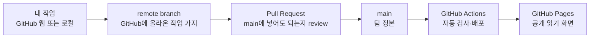

# git & GitHub 협업 가이드 (초보 팀원용)

> 대상: git 기본 명령(add/commit/branch 정도)은 배웠지만 실제 팀 프로젝트에서 어떻게 협업하는지는 처음인 팀원.
> 근거: [codingapple git&GitHub 강좌](https://codingapple.com/course/git-and-github/) 목차(설치 → add/commit/diff → branch → merge 전략 → revert/reset/restore → push → clone/pull → PR → git flow/trunk-based → stash) + [GitHub 공식 GitHub Flow 문서](https://docs.github.com/en/get-started/using-github/github-flow) + [Conventional Commits v1.0.0](https://www.conventionalcommits.org/en/v1.0.0/).
>
> 이 문서는 사용법 가이드다. review·merge 주체와 강제 수준은 [`GitHub 거버넌스 토론 초안`](github-governance-draft.md)의 팀 판정 전까지 확정 규칙이 아니다.

---

## 0. 아무것도 모를 때 먼저 볼 그림

### Git과 GitHub는 다르다

- **git** — 내 컴퓨터와 변경 이력을 관리하는 도구
- **GitHub** — git 저장소를 팀이 함께 보고 review하는 웹 서비스
- **GitHub Pages** — `main`의 `docs/`를 읽기 편한 사이트로 보여주는 공개 화면

파일 하나가 공개 사이트에 도착하는 과정은 다음과 같다.



!!! important "push했다고 main이나 Pages가 바뀌는 것은 아니다"
    `push`는 현재 branch를 GitHub에 올리는 동작이다. 그 branch로 PR을 열고 `main`에 merge해야 팀 정본이 바뀐다. Pages는 그 뒤 자동으로 갱신된다.

실제 예:

- `codex/auto-publish-docs`가 GitHub에 있어도 `main` 화면에는 보이지 않을 수 있다.
- PR이 아직 없으면 Pull requests 탭에는 나타나지 않는다.
- `main`에 merge되기 전에는 운영 Pages도 이전 상태다.

### GitHub 화면의 핵심 기능

| 화면 | 한 문장 역할 | 처음 할 일 |
|---|---|---|
| **Code** | `main`과 각 branch의 파일을 본다. | branch 선택기가 `main`인지 확인한다. |
| **Issues** | 아직 파일을 고치지 않은 질문·아이디어·할 일을 논의한다. | 아이디어나 작업을 한 건씩 연다. |
| **Pull requests** | branch의 변경 diff를 보고 `main` 반영 여부를 판단한다. | `Files changed`에서 실제 변경을 본다. |
| **Actions** | 자동 빌드·검사가 성공했는지 본다. | 초록 체크인지 확인한다. |
| **Projects** | 여러 Issue의 진행 상태를 보드로 본다. | 필요해질 때 사용한다. 첫 PR의 선결 조건은 아니다. |
| **Pages** | `main`의 문서를 외부에 보여준다. | merge 뒤 공개 화면을 확인한다. |
| **Settings** | 권한·branch protection·Pages를 관리한다. | 초기 maintainer만 먼저 다룬다. |

### GitHub 웹만으로 첫 문서 PR 만들기

설치 없이 첫 회차를 돌릴 수 있다.

#### 작성자

1. GitHub에서 레포의 **Code** 탭을 연다.
2. 바꾸려는 markdown 파일을 열고 연필 아이콘 **Edit this file**을 누른다.
3. 내용을 작게 수정한다.
4. **Commit changes...**를 누른다.
5. `Create a new branch for this commit and start a pull request`를 선택한다.
6. branch 이름을 `docs/짧은-설명`으로 적고 **Propose changes**를 누른다.
7. PR 화면에서 아래 두 줄을 적고 **Create pull request**를 누른다.

```text
무엇: 어떤 문서를 어떻게 바꿨다.
왜: 어떤 혼란이나 문제를 해결하려고 바꿨다.
```

#### reviewer

1. **Pull requests** 탭에서 PR을 연다.
2. **Files changed**에서 초록색 추가와 빨간색 삭제를 본다.
3. 다음 세 가지만 확인한다.
   - 작성자가 말한 변경과 실제 diff가 같은가?
   - 내용이 팀 방향과 충돌하지 않는가?
   - 공개돼도 되는 내용인가?
4. **Review changes**에서 Comment, Approve, Request changes 중 하나를 고른다.

#### merge 담당자

1. Actions의 문서 검사가 초록색인지 확인한다.
2. 팀이 정한 주체가 **Merge pull request**를 누른다.
3. merge 뒤 branch를 삭제한다.
4. Actions의 Pages 배포가 끝난 뒤 공개 사이트에서 문서를 확인한다.

처음 회차에는 작성자·reviewer·merge 담당자를 서로 다른 사람이 맡아도 되고, 화면을 함께 보면서 진행해도 된다. 다음 PR에서 역할을 바꾸면 된다.

### 권한 때문에 버튼이 안 보일 때

- 레포에 초대받지 않았거나 write 권한이 없을 수 있다.
- 로그인한 GitHub 계정이 초대받은 계정과 다른지 확인한다.
- 작성자는 자기 PR에 의견을 달 수 있지만, required review의 자기 승인으로 계산되지는 않는다.
- Settings가 안 보이는 것은 보통 관리자 권한이 없기 때문이다.

이 경우 파일이나 명령 문제가 아니라 **계정·collaborator 권한 문제**이므로 초기 maintainer에게 먼저 알린다.

---

## 1. 왜 git / GitHub 인가

코드든 문서든 발표자료든, 여러 명이 같은 파일을 동시에 고치면 반드시 사고가 난다. git은 파일 변경 이력을 통째로 관리해주는 버전관리 프로그램이고, GitHub는 그 git 저장소(repository)를 온라인에 올려 팀원끼리 공유·백업·협업할 수 있게 해주는 서비스다.

우리 팀에게 git/GitHub가 특히 중요한 이유 두 가지:

1. **코드 백업 + 히스토리** — 로컬 컴퓨터가 날아가도 원격 저장소(GitHub)에 전체 이력이 남는다. `git log`로 "언제 누가 무엇을 왜 바꿨는지"를 그대로 추적할 수 있다.
2. **커밋 히스토리 = 기여 기록** — 팀플 특성상 각자 기여도가 갈릴 수 있는데, commit 이력 자체가 "누가 무엇을 했는지"에 대한 가장 정직한 기록이 된다. 발표나 보고서에 "누가 얼마나 했다"를 따로 정리할 필요 없이 `git log --author` 한 줄로 확인 가능하다.

---

## 2. GitHub Flow — 우리가 쓸 기본 작업 흐름

GitHub 공식 문서는 GitHub flow를 "가볍고 브랜치 기반인 워크플로우(a lightweight, branch-based workflow)"로 설명한다. 규모가 큰 회사의 복잡한 git-flow(develop/release/hotfix 브랜치 다중 운영)와 달리, 학기 프로젝트처럼 작은 팀에 잘 맞는다. 아래 6단계를 그대로 따른다.

### ① 브랜치 만들기 (Create a branch)

작업을 시작하기 전에 `main` 브랜치에서 새 브랜치를 판다. 공식 문서 권장대로 **짧고 설명적인 이름**을 쓴다 (예: `feature/fridge-inventory-api`, `docs/idea-selection-criteria`, `fix/pr-template-typo`).

```bash
git switch main
git pull            # main을 최신 상태로 맞추고
git switch -c feature/짧은-설명
```

브랜치 명명 규칙 (권장):

| 접두어 | 용도 | 예시 |
|---|---|---|
| `feature/` | 새 기능 | `feature/refrigerator-cv-model` |
| `fix/` | 버그 수정 | `fix/login-crash` |
| `docs/` | 문서 작업 | `docs/methodology-update` |
| `chore/` | 잡무·설정 | `chore/gitignore-update` |

### ② 커밋하기 (Make changes)

브랜치 위에서 자유롭게 파일을 고치고, 의미 단위로 자주 커밋한다. GitHub 공식 문서는 각 커밋이 "하나의 완결된 변경(an isolated, complete change)"이 되도록 권장한다 — 나중에 문제가 생겼을 때 특정 커밋만 되돌리기(`git revert`) 쉬워지기 때문이다.

**커밋 메시지 규약 — Conventional Commits.** [Conventional Commits v1.0.0](https://www.conventionalcommits.org/en/v1.0.0/) 형식을 따른다:

```
<type>[optional scope]: <description>

[optional body]

[optional footer(s)]
```

자주 쓸 type:

| type | 의미 |
|---|---|
| `feat` | 새 기능 추가 |
| `fix` | 버그 수정 |
| `docs` | 문서만 변경 |
| `refactor` | 동작 변화 없는 코드 정리 |
| `test` | 테스트 추가/수정 |
| `chore` | 빌드·설정 등 잡무 |

예시:

```
feat(fridge): 무게 센서 기반 재고 차감 로직 추가

무게 변화량으로 소진량을 추정하는 1차 버전.
아직 오차 보정 로직은 없음.
```

```
fix: 재고 API 응답 null 처리 누락 수정
```

### ③ Pull Request 열기 (Create a pull request)

작업이 어느 정도(또는 처음부터, 아래 §5 참고) 진행되면 `main`으로 향하는 Pull Request(PR)를 연다. 공식 문서 권장대로 PR 설명에는 **"무엇을 바꿨고 어떤 문제를 해결하는지(a summary of the changes and what problem they solve)"**를 적는다. 관련 이슈가 있으면 `Closes #12`처럼 링크해서, 머지되면 이슈가 자동으로 닫히게 한다.

### ④ 리뷰 반영 (Address review comments)

팀원이 코멘트를 남기면 같은 브랜치에 커밋을 추가해서 반영한다. PR은 자동으로 갱신된다. 리뷰는 형식적 통과 의례가 아니라 §5의 "노출 규범"이 실제로 작동하는 지점이다.

### ⑤ 머지 (Merge your pull request)

리뷰어 승인을 받으면 `main`에 머지한다. 머지 방식은 3가지 중 팀 상황에 맞게 고른다 (codingapple 강좌 "다양한 git merge 방법" 참고):

| 방식 | 결과 | 언제 |
|---|---|---|
| **Merge commit** (3-way) | 브랜치 히스토리가 그대로 main에 남음 | 큰 기능, 기록을 남기고 싶을 때 |
| **Squash and merge** | 브랜치의 여러 커밋을 하나로 합쳐서 main에 붙임 | 자잘한 커밋이 많은 작은 브랜치 (기본 권장) |
| **Rebase and merge** | 브랜치를 main 최신 위로 옮긴 뒤 커밋 이력을 그대로 보존 | 커밋을 개별적으로 남기고 싶을 때 |

### ⑥ 브랜치 삭제 (Delete your branch)

머지가 끝난 브랜치는 삭제한다. GitHub 공식 문서에 따르면 "PR과 커밋 히스토리는 삭제되지 않는다(your pull request and commit history will not be deleted)" — 즉 기록은 그대로 남으니 안심하고 지워도 된다.

---

## 3. 여러 명이 동시에 작업하기

### Collaborators 등록

팀원 전원의 GitHub 계정을 저장소 Settings → Collaborators에 등록해야 push 권한이 생긴다.

### `git pull` 먼저, `git push`는 그 다음

원격 저장소가 나 아닌 다른 사람에 의해 업데이트된 상태에서 바로 `git push`하면 거부된다. 항상 아래 순서를 지킨다:

```bash
git pull    # 원격의 최신 내용을 가져와 합침 (fetch + merge)
git push
```

### 충돌(conflict) 기초 해결법

같은 파일, 같은 줄을 동시에 고치면 merge/pull 시 conflict가 난다. 에디터에서 파일을 열면 아래 마커가 보인다:

```
<<<<<<< HEAD
내 브랜치 내용
=======
합쳐지는 브랜치 내용
>>>>>>> 브랜치명
```

`<<<<<<<` / `=======` / `>>>>>>>` 마커를 지우고 최종적으로 남길 코드만 남긴 뒤:

```bash
git add 충돌났던파일
git commit
```

하면 충돌 해결이 끝난 새 커밋이 생성된다. VSCode 등 에디터의 "Accept Incoming/Current Change" 버튼을 쓰면 더 편하다.

### 공동 작업(페어/몹 프로그래밍) 표기 — `Co-authored-by:`

한 커밋을 두 명 이상이 함께 만들었을 때(같이 화면 보면서 짰다든지) 커밋 메시지 맨 아래에 아래 트레일러를 추가하면 GitHub가 두 사람 모두를 커밋 작성자로 표시해준다:

```
feat(zoning): 가상 공간 경계 판단 로직 초안

Co-authored-by: 팀원이름 <팀원GitHub이메일>
```

---

## 4. 실수 되돌리기 (요약)

| 상황 | 명령 |
|---|---|
| 커밋 안 한 파일 하나만 되돌리고 싶음 | `git restore 파일명` |
| 특정 커밋 하나만 취소하고 싶음 (기록은 남김) | `git revert 커밋ID` |
| 그냥 특정 시점으로 완전히 되돌리고 싶음 (위험, 협업 중엔 지양) | `git reset --hard 커밋ID` |
| 지금 코드 잠깐 치워두고 싶음 | `git stash` / `git stash pop` |

`git reset --hard`는 팀 공유 브랜치에서 쓰면 다른 사람 작업까지 날릴 수 있으니, 협업 중인 브랜치에서는 되도록 `git revert`를 쓴다.

---

## 5. 팀 규범 제안 — 순서와 노출 (완성본을 던지지 않는다)

위 GitHub Flow는 GitHub가 공식적으로 정의한 뼈대일 뿐, "언제 PR을 열지"까지 강제하지는 않는다. **이건 매체가 강제하는 규칙이 아니라 우리 팀이 토론할 협업 규범 제안이다.**

문제 의식: 한 사람이 문제를 완전히 풀어서 완성된 결과물을 통째로 던지면, 다른 팀원은 이미 답이 나온 상태에서 시작하게 되어 **스스로 문제를 탐색하고, 다른 접근을 시도해보고, 결과물에 대한 소유감을 가질 기회**가 닫혀버린다. (`docs/process/아이디어-설계-프로세스.md`가 강조하는 "완성된 표현보다 각자 구체화하며 부족한 부분을 발견하는 과정"과 같은 원리다.)

그래서 우리 팀은 다음 순서를 지킨다:

1. **문제·질문·뼈대를 먼저 공유한다.** 코드를 다 짜기 전에, 이슈(Issue)나 Draft PR로 "이런 문제를 이렇게 풀려고 한다"를 먼저 올린다.
2. **각자 독립적으로 견해를 형성할 시간을 준다.** 다른 팀원이 그 이슈/Draft PR을 보고 자기 나름의 판단·의견·대안을 먼저 만들 수 있게 한다.
3. **완성된 답은 그 다음이다.** 논의가 어느 정도 쌓인 뒤에 구현을 완성하고 정식 PR로 전환한다.

이 순서를 브랜치/PR 구조에 대응시키면:

- **브랜치 = 독립적 탐색 공간.** 브랜치 위에서는 자유롭게, 눈치 안 보고 시도해본다. 아직 다른 사람에게 보여줄 준비가 안 된 상태라도 괜찮다.
- **PR = 의도된 노출 지점.** 브랜치의 내용을 팀에게 "보여주기로 결정한" 순간이 PR을 여는 순간이다. 다 만들고 나서 여는 게 기본은 아니다 — 문제 정의나 뼈대만 있는 상태에서 **Draft PR**로 먼저 열어 "이 방향 맞아?"를 묻는 것도 정상적인 사용법이다.

실무 규칙:

- 하루 이상 걸릴 작업이면, 코드를 다 짜기 전에 Draft PR이나 이슈로 방향을 먼저 공유한다.
- 다른 팀원의 담당 영역이라도 완성본만 보고 리뷰하지 말고, 뼈대 단계에서 의견을 낼 기회를 스스로 챙긴다.
- "이미 다 짜놨으니 그냥 승인해줘"는 지양한다 — 리뷰가 형식적 통과 의례가 되지 않도록 한다.

---

## 참고

- GitHub 공식 GitHub Flow 문서: https://docs.github.com/en/get-started/using-github/github-flow
- Conventional Commits v1.0.0: https://www.conventionalcommits.org/en/v1.0.0/
- codingapple git&GitHub 무료 강좌 (설치~stash 전체 목차): https://codingapple.com/course/git-and-github/
